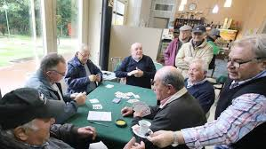
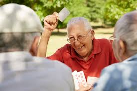

```{r}
#| echo: false

rm(list=ls())


```
## [Accenni storici]{style="color:#004c4c;"} {.scrollable transition="zoom"}
Il gioco ha origini non troppo chiare: 

. . .

- Alcune teorie indicano un'origine francese dai giochi brusquembille e bazzica, olandese (popolare tra i marinai) o addirittura spagnola (importata come brisca nel XVI secolo durante la dominazione).

. . .

- Il termine potrebbe derivare dal francese brisque, che indicava i galloni sulle uniformi dei soldati, o dalla Bazzica, un gioco simile. 

. . . 

- Arrivata in Italia probabilmente nel corso del '700-800, la prima traccia scritta risale al 1828

. . .

- Importata via mare da marinai olandesi o attraverso la dominazione spagnola, l gioco si è radicato profondamente nella cultura italiana, specialmente in Toscana, Liguria, Campania e Sicilia, fino a diventare un rito di socializzazione in osterie e bar.

. . .

- Il primo trattato ufficiale di regole è del 1888

. . .

## [Regole di base]{style="color:#004c4c;"} {transition="zoom"}

::: {.incremental}
-  40 carte 
- 2 o 4 giocatori 
- 3 carte a testa
- una carta capovolta sul tavolo, che decide il seme dominante: [la briscola]{style="color:#66b2b2;"}
- vince la mano chi tira la carta più alta dello stesso seme della prima carta tirata o la briscola più alta 
- vince la partita che ha ottenuto il punteggio più alto (ogni carte ha un valore numerico)
:::

## [Consigli tattici]{style="color:#004c4c;" transition="convex"}

```{.r code-line-numbers="2|4|6|8"}

LETTERS[c(13,1,9)]
  
LETTERS[c(6,9,4,1,18,19,9)]
  
LETTERS[c(4,5,9)]
  
LETTERS[c(14,15,14,14,9)]


```

## [Consigli tattici]{style="color:#004c4c;"} {.unlisted transition="zoom fade"}


```{r }
#| echo: true
#| code-fold: true

LETTERS[c(13,1,9)]
  
LETTERS[c(6,9,4,1,18,19,9)]
  
LETTERS[c(4,5,9)]
  
LETTERS[c(14,15,14,14,9)]

```


## [Importanza culturale]{style="color:#004c4c;" auto-animate="true" transition="concave"}

Nel corso del tempo è diventato uno degli emblemi dell'italianità 

## [Importanza culturale]{style="color:#004c4c;"}{.unlisted auto-animate="true"}

Nel corso del tempo è diventato uno degli emblemi dell'italianità 

\

Rappresenta un moemento di socialita e un motivo di incontro 

## [Importanza culturale]{style="color:#004c4c;"}{.unlisted auto-animate="true"}

Nel corso del tempo è diventato uno degli emblemi dell'italianità 

\

Inoltre, è un punto di contatto fra generazioni 

\

Rappresenta un moemento di socialita e un motivo di incontro 


## [Importanza culturale]{style="color:#004c4c;"}{.unlisted auto-animate="true" transition="slide"}

Nel corso del tempo è diventato uno degli emblemi dell'italianità 

\

Inoltre, è un punto di contatto fra generazioni 

\

Rappresenta un moemento di socialita e un motivo di incontro

\

Ma non è da prendere sottogamba, ["competizione"]{style="color:#cc9f8c;"} è la parola d'ordine 

## {.unlisted auto-animate="true" transition="slide"} 
{.absolute top=0 left=0 width="300" height="300"}`

## {.unlisted auto-animate="true" transition="slide"}
{.absolute top=0 left=0 width="300" height="300"}

:::{style="position: absolute; top: 300px; left: 5px;"}
[COMPETIZIONE]{style="color:#cc9f8c;"}
:::

## {.unlisted auto-animate="true" transition="slide"}
{.absolute top=0 left=0 width="300" height="300"}

:::{style="position: absolute; top: 300px; left: 5px;"}
[COMPETIZIONE]{style="color:#cc9f8c;"}
:::


{.absolute bottom=0 right=0 width="300" height="300"}

:::{style="position: absolute; top: 300px; right: 5px;"}
[MA ANCHE DIVERTIMENTO]{style="color:#cc9f8c;"}
:::


## {.unlisted auto-animate="true" transition="slide"}
{.absolute top=0 left=0 width="300" height="300"}

:::{style="position: absolute; top: 300px; left: 5px;"}
[COMPETIZIONE]{style="color:#cc9f8c;"}
:::


{.absolute bottom=0 right=0 width="300" height="300"}

:::{style="position: absolute; top: 300px; right: 5px;"}
[MA ANCHE DIVERTIMENTO]{style="color:#cc9f8c;"}
:::

::: aside

[È proprio una cosa seria]{style="color:#c68642;"}

:::


## [Concludendo]{style="color:#004c4c;" transition="none"}

la brscola non è solo un gioco...

. . .  

<div style="text-align: right;">
...ma un fatto di cultura 
</div>

. . . 

Se volete imparare ecco le 

. . .

::: {style="text-align: center;"}
[regole](https://digilander.libero.it/elioab/data/RegolamentoBriscola.pdf){style="color:#c68642;"}
:::

## {.unlisted auto-animate="true" transition="none"}

<style>
@keyframes pulse {
  0%   { transform: scale(1);    opacity: 1; }
  50%  { transform: scale(1.08); opacity: 0.7; }
  100% { transform: scale(1);    opacity: 1; }
}
</style>

<div style="text-align: center; font-size: 2.5em; font-weight: bold; animation: pulse 1.5s infinite; margin-top: 200px;">
[GRAZIE DELL'ASCOLTO]{style="color:#5f1d48;"}
</div>


## {.unlisted auto-animate="true" transition="none"}

<style>
@keyframes pulse {
  0%   { transform: scale(1);    opacity: 1; }
  50%  { transform: scale(1.08); opacity: 0.7; }
  100% { transform: scale(1);    opacity: 1; }
}
</style>

<div style="text-align: center; font-size: 2.5em; font-weight: bold; animation: pulse 1.5s infinite; margin-top: 200px;">
[GRAZIE DELL'ASCOLTO]{style="color:#5f1d48;"}
</div>

::: aside

[SPERO DI AVERVI FATTO VENIRE VOGLIA DI GIOCARE ;)]{style="color:#c68642;"}

:::

## {.unlisted auto-animate="true" transition="none"}

:::{style="text-align: center; font-size: 2em; margin-top: 30%;"}
Vera Gelli
:::
